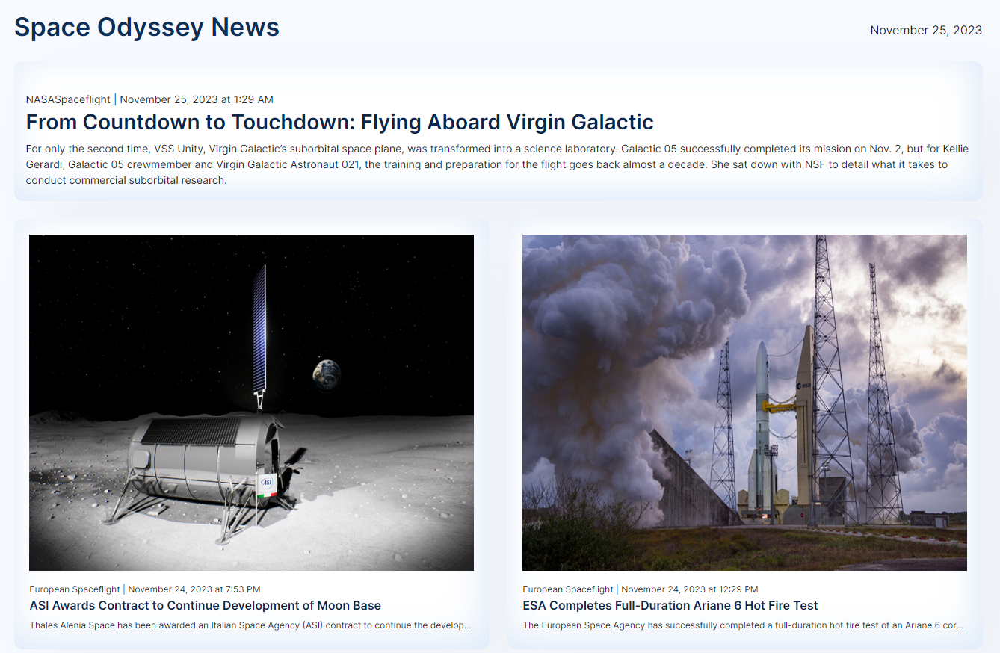

# Space News API with ReactJS

## WHAT IS THIS ?
Space Odyssey News is a cosmic adventure into real-time space news, bringing the latest updates directly to your orbit. Fueled by APIs and React, this app ensures users are cosmically connected around the globe with latest tea.

## WHERE CAN I FIND THIS?
Check out the live demo by clicking [here](https://admirable-boba-22cc1b.netlify.app/)!

## WHY SHOULD YOU USE THIS ?
- Real-time Data: Space Odyssey News serves news straight from the celestial kettle every time something happens!
- Display News: Witness space news articles gracefully pirouette onto your screen.
- User-friendly Interface: The application boasts an interface so user-friendly that even a Martian would feel right at home. Explore the latest space news with a single click.

## HOW TO USE ?
- Let the application do its cosmic dance, fetching space news and displaying the articles on your screen.
- Navigate the cosmos of space news articles effortlessly, staying informed about the latest happenings in the intergalactic industry.